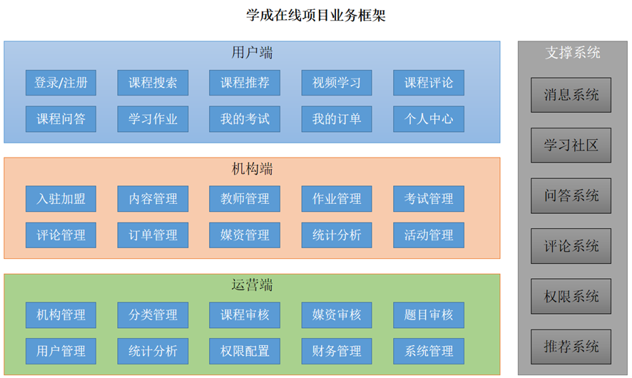
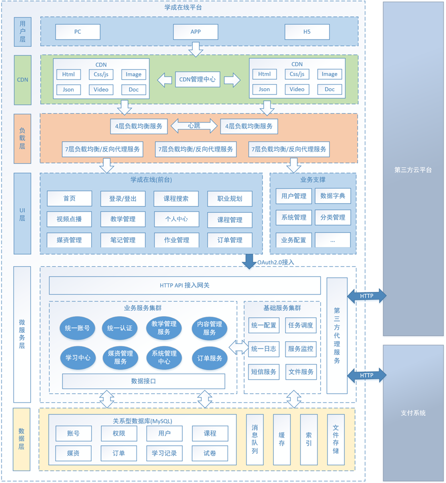

# 学成网项目

1.项目介绍
下边分别从业务和技术两个方式介绍项目。

1.1 项目业务介绍
本项目包括了用户端、机构端、运营端。
核心模块包括：内容管理、媒资管理、课程搜索、订单支付、选课管理、认证授权等。
下图是项目的功能模块图：

1.3 项目技术架构
本项目采用前后端分离架构，后端采用SpringBoot、SpringCloud技术栈开发，数据库使用了MySQL，还使用的Redis、消息队列、分布式文件系统、Elasticsearch等中间件系统。
划分的微服务包括：内容管理服务、媒资管理服务、搜索服务、订单支付服务、 学习中心服务、系统管理服务、认证授权服务、网关服务、注册中心服务、配置中心服务等。
下图是项目的技术架构图：

